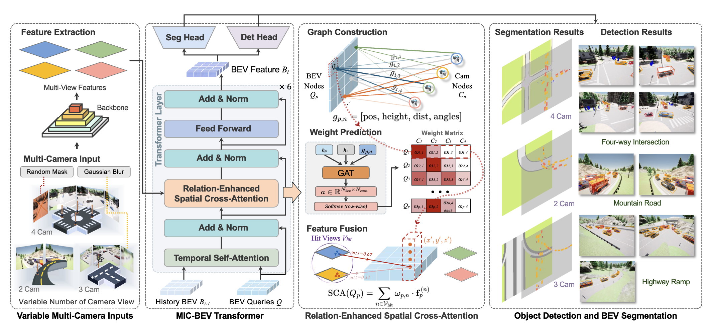

<div align="center">

# **MIC-BEV: Multi-Infrastructure Camera Bird's-Eye-View Transformer with Relation-Aware Fusion for 3D Object Detection**

[](https://arxiv.org/abs/2510.24688)
[](https://huggingface.co/datasets/handsomeYun/M2I)


</div>

---

## 🌐 Overview

**MIC-BEV** (Multi-Infrastructure Camera Bird’s-Eye-View Transformer) is a Transformer-based 3D perception framework designed for **infrastructure-mounted multi-camera systems**.  
It introduces a *camera–BEV relation-aware attention* mechanism that models geometric relations between each camera and BEV cell via a **graph neural network (GNN)**, enabling adaptive multi-view fusion under diverse camera configurations.

MIC-BEV jointly performs **3D object detection** and **BEV segmentation**, achieving robust performance across:
- Heterogeneous camera setups  
- Adverse weather and lighting conditions  
- Complex road layouts (intersections, ramps, roundabouts, etc.)

To support model training and evaluation, we also introduce **M2I**, a synthetic dataset featuring **diverse scenes, camera configurations, and environmental conditions** for infrastructure perception research.

---

## 📄 Paper and Resources

- **Paper:** [Paper](https://arxiv.org/abs/2510.24688)  
- **Dataset:** [M2I Benchmark](https://huggingface.co/datasets/handsomeYun/M2I)  

---

# Installation

This project requires specific versions of dependencies to ensure compatibility. Follow the installation steps below carefully.

## Prerequisites

- CUDA 11.1 compatible GPU
- Conda package manager
- Git

## Environment Setup

### 1. Create and Activate Conda Environment

```bash
conda create -n open-mmlab python=3.8 -y
conda activate open-mmlab
```

### 2. Install PyTorch

```bash
pip install torch==1.9.1+cu111 torchvision==0.10.1+cu111 torchaudio==0.9.1 -f https://download.pytorch.org/whl/torch_stable.html
```

### 3. Install MMCV and MMDetection

```bash
pip install mmcv-full==1.4.0
pip install mmdet==2.14.0
pip install mmsegmentation==0.14.1
```

### 4. Install Additional Dependencies

```bash
pip install einops fvcore seaborn iopath==0.1.9 timm==0.6.13 typing-extensions==4.5.0 pylint ipython==8.12 numpy==1.19.5 matplotlib==3.5.2 numba==0.48.0 pandas==1.4.4 scikit-image==0.19.3 setuptools==59.5.0
```

### 5. Install Detectron2

```bash
pip install detectron2==0.5 -f https://dl.fbaipublicfiles.com/detectron2/wheels/cu111/torch1.9/index.html
```

### 6. Install Graph Neural Network Libraries

```bash
pip install torch_scatter==2.0.9 torch_sparse==0.6.12 torch_cluster==1.5.9 torch_spline_conv==1.2.1 -f https://data.pyg.org/whl/torch-1.9.1+cu111.html
pip install torch-geometric==2.1.0
```

### 7. Install CUDA Toolkit

```bash
conda install -y -c conda-forge cudatoolkit=11.1
export LD_LIBRARY_PATH="$CONDA_PREFIX/lib:$LD_LIBRARY_PATH"
export PYTHONPATH="$PWD:$PYTHONPATH"
```

### 8. Install MMDetection3D

```bash
git clone https://github.com/open-mmlab/mmdetection3d.git
cd mmdetection3d
git checkout v0.17.1  # Other versions may not be compatible
pip install -v -e .
```

### 9. Install RoScenes Dataset

```bash
cd RoScenes
pip install -e .
```

### 10. Download Pre-trained Model

```bash
mkdir MIC-BEV/ckpts
cd MIC-BEV/ckpts
wget https://github.com/zhiqi-li/storage/releases/download/v1.0/r101_dcn_fcos3d_pretrain.pth
```

### 11. Install Final Dependencies

```bash
pip install yapf==0.31.0
pip install numpy==1.19.5
pip install pillow==9.5.0
```

## Important Notes

- Make sure to use the exact versions specified in the installation commands
- The environment requires CUDA 11.1 compatibility
- MMDetection3D version 0.17.1 is specifically required for compatibility
- Ensure all environment variables are properly set

# Getting Started

After completing the installation above, you can:

- Prepare your dataset following the MMDetection3D guidelines
- Use the MIC-BEV configuration files in `projects/configs/mic-bev/`
- Run training and evaluation using the provided tools

### Prepare Dataset
#### M2I Dataset

To prepare the M2I-style data (e.g., V2XSet), use the provided preprocessing script:

```bash
python MIC-BEV_Official/tools/data_converter/mic-bev/create_v2xset_multiple_map.py
```
This will process raw V2XSet-format data and generate the necessary multi-map annotations for training MIC-BEV.

#### RoScenes Dataset
To use the RoScenes dataset, follow the official RoScenes repository [https://github.com/roscenes/RoScenes] to download and prepare the data. 

## Quick Start

1. **Training**: Use the MIC-BEV configuration file:
   
   *Single-GPU Training*: 
   ```bash
   python tools/train.py \
    projects/configs/mic-bev/mic-bev-seg-gnn.py \
    --work-dir work_dirs/micbev_single
   ```

   *Multi-GPU Distributed Training*
   ```bash
   python -m torch.distributed.launch \
    --nproc_per_node=8 \
    --master_port=12355 \
    tools/train.py \
    projects/configs/mic-bev/mic-bev-seg-gnn.py \
    --launcher pytorch \
    --work-dir work_dirs/micbev_ddp
   ```

   *Resume Training*
   ```bash
   python -m torch.distributed.launch \
    --nproc_per_node=8 \
    --master_port=12355 \
    tools/train.py \
    projects/configs/mic-bev/mic-bev-seg-gnn.py \
    --launcher pytorch \
    --work-dir work_dirs/micbev_ddp \
    --resume-from work_dirs/micbev_ddp/latest.pth
   ```

3. **Evaluation**: Evaluate your trained model:
   ```bash
   python tools/test.py \
    projects/configs/mic-bev/mic-bev-seg-gnn.py \
    work_dirs/micbev_ddp/latest.pth \
    --eval bbox
   ```


## Configuration

The main MIC-BEV configuration is located at:
- For M2I: `projects/configs/mic-bev/mic-bev-seg-gnn.py`
- For Roscenes: `projects/configs/mic-bev/mic-bev-roscenes-fp16.py`

# Acknowledgement

Many thanks to these excellent open source projects:
- [bevformer](https://github.com/fundamentalvision/BEVFormer)
- [dd3d](https://github.com/TRI-ML/dd3d) 
- [detr3d](https://github.com/WangYueFt/detr3d) 
- [mmdet3d](https://github.com/open-mmlab/mmdetection3d)

## Citation
 If you are using our OpenCDA framework or codes for your development, please cite the following paper:
 ```bibtex
@misc{zhang2025micbev,
  title        = {MIC-BEV: Multi-Infrastructure Camera Bird's-Eye-View Transformer with Relation-Aware Fusion for 3D Object Detection},
  author       = {Zhang, Yun and Zheng, Zhaoliang and Liu, Johnson and Huang, Zhiyu and Zhou, Zewei and Meng, Zonglin and Cai, Tianhui and Ma, Jiaqi},
  year         = {2025},
  eprint       = {2510.24688},
  archivePrefix= {arXiv},
  primaryClass = {cs.CV},
  url          = {https://arxiv.org/abs/2510.24688}
}

```
The arxiv link to the paper:  [https://arxiv.org/abs/2107.06260](https://arxiv.org/abs/2510.24688)

## License

This project is released under a UCLA research license.

The MIC-BEV codebase is provided for non-commercial academic research only.
Researchers are permitted to use and modify the source code for their own research purposes.

The following uses are not permitted under this license:
- Commercial use of any kind
- Contracted work that generates corporate or institutional revenue
- Redistribution for commercial products or services
- Please refer to the LICENSE file for full terms and for information on potential commercial licensing opportunities.
