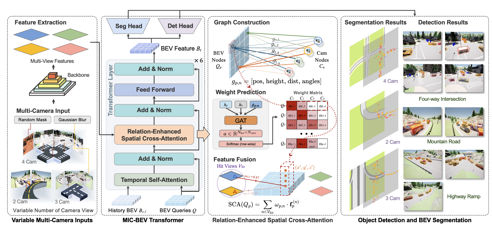

<div align="center">

# **MIC-BEV: Multi-Infrastructure Camera Bird's-Eye-View Transformer with Relation-Aware Fusion for 3D Object Detection**

[](https://arxiv.org/abs/2510.24688)
[](https://huggingface.co/datasets/handsomeYun/M2I)

<video src="https://github.com/user-attachments/assets/6783612d-22d0-4de0-a484-9d462d79f2e7" autoplay loop muted playsinline width="100%"></video>

<video src="https://github.com/user-attachments/assets/76a1a119-0a8c-4421-b34c-2d835e7b9c12" autoplay loop muted playsinline width="100%"></video>



</div>

---

## 🌐 Overview

**MIC-BEV** (Multi-Infrastructure Camera Bird's-Eye-View Transformer) is a Transformer-based 3D perception framework designed for **infrastructure-mounted multi-camera systems**. It introduces a **camera-BEV relation-aware attention** mechanism that models the geometric relations between each camera and BEV cell via a **graph neural network (GNN)**, enabling adaptive multi-view fusion under diverse and heterogeneous camera configurations.

MIC-BEV jointly performs **3D object detection** and **BEV segmentation**, and is designed to stay robust across:

- Heterogeneous camera setups (varying camera counts, poses, and intrinsics)
- Adverse weather and lighting conditions
- Complex road layouts (intersections, ramps, roundabouts, etc.)

To support training and evaluation, we also release **M2I**, a synthetic dataset featuring diverse scenes, camera configurations, and environmental conditions for infrastructure perception research.

---

## Installation

This project requires specific versions of dependencies to ensure compatibility. Follow the installation steps below carefully.

### Prerequisites

- A CUDA 11.1 compatible GPU
- Conda
- Git

### 1. Create and activate the conda environment

```bash
conda create -n open-mmlab python=3.8 -y
conda activate open-mmlab
```

### 2. Install PyTorch

```bash
pip install torch==1.9.1+cu111 torchvision==0.10.1+cu111 torchaudio==0.9.1 -f https://download.pytorch.org/whl/torch_stable.html
```

### 3. Install MMCV / MMDetection / MMSegmentation

```bash
pip install mmcv-full==1.4.0
pip install mmdet==2.14.0
pip install mmsegmentation==0.14.1
```

### 4. Install additional Python dependencies

```bash
pip install einops fvcore seaborn iopath==0.1.9 timm==0.6.13 typing-extensions==4.5.0 pylint ipython==8.12 numpy==1.19.5 matplotlib==3.5.2 numba==0.48.0 pandas==1.4.4 scikit-image==0.19.3 setuptools==59.5.0
```

### 5. Install Detectron2

```bash
pip install detectron2==0.5 -f https://dl.fbaipublicfiles.com/detectron2/wheels/cu111/torch1.9/index.html
```

### 6. Install Graph Neural Network Libraries

```bash
pip install torch_scatter==2.0.9 torch_sparse==0.6.12 torch_cluster==1.5.9 torch_spline_conv==1.2.1 -f https://data.pyg.org/whl/torch-1.9.1+cu111.html
pip install torch-geometric==2.1.0
```

### 7. Set up the CUDA toolkit and paths

Run this from the repository root:

```bash
conda install -y -c conda-forge cudatoolkit=11.1
export LD_LIBRARY_PATH="$CONDA_PREFIX/lib:$LD_LIBRARY_PATH"
export PYTHONPATH="$PWD:$PYTHONPATH"
```

### 8. Install MMDetection3D

```bash
git clone https://github.com/open-mmlab/mmdetection3d.git
cd mmdetection3d
git checkout v0.17.1  # Other versions may not be compatible
pip install -v -e .
cd ..
```

### 9. (RoScenes only) Install the RoScenes toolkit

```bash
git clone https://github.com/roscenes/RoScenes.git
cd RoScenes
pip install -e .
cd ..
```

### 10. Download the pretrained backbone

Run this from the repository root (the config expects the checkpoint at `ckpts/`):

```bash
mkdir -p ckpts
wget -P ckpts https://github.com/zhiqi-li/storage/releases/download/v1.0/r101_dcn_fcos3d_pretrain.pth
```

### 11. Install Final Dependencies

```bash
pip install yapf==0.31.0 numpy==1.19.5 pillow==9.5.0
```

A full reference export of a working environment is provided in
[`environment_open-mmlab.yml`](environment_open-mmlab.yml).

- Make sure to use the exact versions specified in the installation commands
- The environment requires CUDA 11.1 compatibility
- MMDetection3D version 0.17.1 is specifically required for compatibility
- Ensure all environment variables are properly set

## Dataset Preparation

After completing the installation above, prepare the dataset(s) you plan to use.

### M2I

1. Download the dataset from
   [huggingface.co/datasets/handsomeYun/M2I](https://huggingface.co/datasets/handsomeYun/M2I)
   using the Hugging Face CLI:

   ```bash
   hf download handsomeYun/M2I \
     --repo-type dataset \
     --local-dir /data/dataset/M2I
   ```

2. The images are split into multi-part archives. Concatenate the parts and extract them:

   ```bash
   mkdir -p /data/dataset/M2I_data
   cat /data/dataset/M2I/M2I_split_dataset.tar.gz.part-* \
     | tar -xzvf - -C /data/dataset/M2I_data
   ```

3. Generate the multi-map annotations (V2XSet-format raw data → training pkls):

   ```bash
   python tools/data_converter/mic-bev/create_v2xset_multiple_map.py
   ```

4. Edit `projects/configs/mic-bev/mic-bev-seg-gnn.py` and set the paths to match your
   extracted data:

   ```python
   data_root = '/data/dataset/M2I_data/M2I_split_dataset'
   pkl_root  = '/data/dataset/M2I/M2I_pkl'
   ```

### RoScenes

1. Follow the official [RoScenes repository](https://github.com/roscenes/RoScenes) to download
   and prepare the data.
2. Edit `projects/configs/mic-bev/mic-bev-roscenes-fp16-robust.py` and set:

   ```python
   data_root = '/path/to/roscenes_data'
   ```

---

## Configuration files

All training, evaluation, and visualization commands below take one of these two
config files as their argument:

| Dataset  | Config file |
|----------|-------------|
| M2I      | `projects/configs/mic-bev/mic-bev-seg-gnn.py` |
| RoScenes | `projects/configs/mic-bev/mic-bev-roscenes-fp16-robust.py` |

The examples use the M2I config; swap in the RoScenes config to run on RoScenes.

---

## Training

### Single GPU

```bash
python tools/train.py \
  projects/configs/mic-bev/mic-bev-seg-gnn.py \
  --work-dir work_dirs/micbev_single
```

### Multi-GPU (distributed)

Set `CUDA_VISIBLE_DEVICES` to the GPUs you want to use and match `--nproc_per_node` to the
number of GPUs. Export `PYTHONPATH` so the `projects/` package is importable:

```bash
CUDA_VISIBLE_DEVICES=0,1,2,3,4,5 \
PYTHONPATH=$PWD:$PYTHONPATH \
python -m torch.distributed.launch \
  --master_port 12365 \
  --nproc_per_node=6 \
  tools/train.py \
  --launcher pytorch \
  projects/configs/mic-bev/mic-bev-seg-gnn.py \
  --work-dir /path/to/work_dir/no_robust
```

### Resume from a checkpoint

Add `--resume-from` pointing at the checkpoint you want to continue from:

```bash
CUDA_VISIBLE_DEVICES=0,1,2,3,4,5 \
PYTHONPATH=$PWD:$PYTHONPATH \
python -m torch.distributed.launch \
  --master_port 12365 \
  --nproc_per_node=6 \
  tools/train.py \
  --launcher pytorch \
  projects/configs/mic-bev/mic-bev-seg-gnn.py \
  --work-dir /path/to/work_dir/no_robust \
  --resume-from /path/to/work_dir/no_robust/latest.pth
```

To train on RoScenes instead, swap in
`projects/configs/mic-bev/mic-bev-roscenes-fp16-robust.py`.

---

## Evaluation

```bash
python tools/test.py \
  projects/configs/mic-bev/mic-bev-seg-gnn.py \
  work_dirs/micbev_ddp/latest.pth \
  --eval bbox
```

### M2I test modes

The command above uses whatever is currently set in `mic-bev-seg-gnn.py`. Two
**independent** switches in that config decide what the test measures:

1. The `RandomMaskMultiView` step in `test_pipeline` — on = corrupt cameras at
   test time, off = clean cameras.
2. Which PKL `ann_file_test` points to — the standard test set vs. the
   extreme-weather subset.

| Mode | `RandomMaskMultiView` | `ann_file_test` |
|------|-----------------------|-----------------|
| **Normal** | commented out | standard test PKL |
| **Robust** | enabled | standard test PKL |
| **Extreme weather** | either | extreme-weather PKL |

**Switch 1 — normal vs. robust.** Toggle the `RandomMaskMultiView` line in
`test_pipeline`:

```python
# Normal (clean cameras): leave this line commented out
# dict(type='RandomMaskMultiView', mask_prob=1, blur_sigma=(10, 10.0),
#      blur_kernel_size_range=(11, 11), mask_ratio=0.5, blur_ratio=0.5,
#      deterministic=True),

# Robust (test-time masking/blur): keep this line active
dict(type='RandomMaskMultiView', mask_prob=1, blur_sigma=(10, 10.0),
     blur_kernel_size_range=(11, 11), mask_ratio=0.5, blur_ratio=0.5,
     deterministic=True),
```

**Switch 2 — standard vs. extreme weather.** First build the extreme-weather PKL
from the standard test PKL:

```bash
python tools/data_converter/mic-bev/create_extreme_weather_test_pkl.py \
  --input  /path/to/M2I/M2I_pkl/v2xset_infos_temporal_test.pkl \
  --output /path/to/M2I/M2I_pkl/v2xset_infos_temporal_extreme_test.pkl
```

Then point `ann_file_test` at it in the config:

```python
# ann_file_test = pkl_root + "/v2xset_infos_temporal_test.pkl"
ann_file_test = pkl_root + "/v2xset_infos_temporal_extreme_test.pkl"
```

After editing the config, re-run the same `tools/test.py` command shown above.

---

## Visualization (M2I)

Rendering the predicted 3D boxes for M2I is a two-step process.

**Step 1 — run inference and dump the detection results.** `tools/test_vis.py`
runs the model and writes a `results_nusc.json` file under
`test/<config-name>/<timestamp>/`:

```bash
CUDA_VISIBLE_DEVICES=0 python tools/test_vis.py \
  projects/configs/mic-bev/mic-bev-seg-gnn.py \
  /path/to/model/trained/latest.pth \
  --eval bbox
```

**Step 2 — render the boxes.** `tools/analysis_tools/fast_visualize_results.py`
reads that `results_nusc.json` (no GPU/checkpoint needed) and draws the predicted
3D boxes on the camera images. Pass the JSON produced in Step 1, an output folder,
and the same `--ann-file` / `--data-root` you set in the config:

```bash
python tools/analysis_tools/fast_visualize_results.py \
  test/mic-bev-seg-gnn/<timestamp>/results_nusc.json \
  data_dumping \
  --config projects/configs/mic-bev/mic-bev-seg-gnn.py \
  --ann-file /path/to/M2I/M2I_pkl/v2xset_infos_temporal_test.pkl \
  --data-root /path/to/M2I_data/M2I_split_dataset \
  --show-map
```

Rendered images are written to the output folder (`data_dumping` above). You can
optionally add `--start` (index of the first sample, defaults to `0`) and
`--num-samples` (how many samples to render) to control the range; add
`--show-map` to also save the BEV map with GT/predicted boxes overlaid.

---

## Acknowledgement

Many thanks to these excellent open-source projects, which MIC-BEV builds upon:

- [BEVFormer](https://github.com/fundamentalvision/BEVFormer)
- [DD3D](https://github.com/TRI-ML/dd3d)
- [DETR3D](https://github.com/WangYueFt/detr3d)
- [MMDetection3D](https://github.com/open-mmlab/mmdetection3d)
- [RoScenes](https://github.com/roscenes/RoScenes)

---

## License

This project is released under the terms in [`LICENSE.txt`](LICENSE.txt). Note that some third-party
components included or required by this project (e.g., MMDetection3D and the RoScenes toolkit)
are distributed under their own licenses; please review and comply with those terms as well.

---

## Citation

If you use this code in your research, please cite:

```bibtex
@article{zhang2025mic,
  title={MIC-BEV: Multi-Infrastructure Camera Bird's-Eye-View Transformer with Relation-Aware Fusion for 3D Object Detection},
  author={Zhang, Yun and Zheng, Zhaoliang and Liu, Johnson and Huang, Zhiyu and Zhou, Zewei and Meng, Zonglin and Cai, Tianhui and Ma, Jiaqi},
  journal={arXiv preprint arXiv:2510.24688},
  year={2025}
}
```
